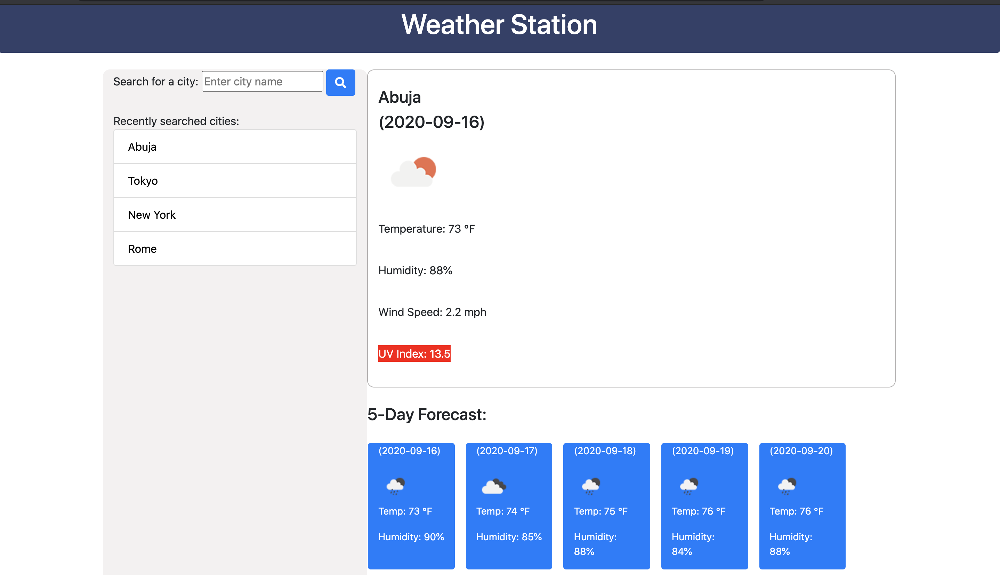

# Weather Station 🌥

This application will help you keep track of the weather in any place you go to

### GitHub Page with [Live Version!] (https://piotr72us.github.io/weatherStation/)

### Programming Languages Used:
---
```
* `JavaScript`: 54.5%
* `CSS`: 7.9%
* `HTML`: 37.6%
```

### About this application:
---
When you search for a city, you will see the following info:
+ the city name,
+ icon showing the current weather,
+ temperature in F, 
+ humidity level, 
+ wind speed,
+ UV index number (UV index color will change depending on current UV conditions so that you will know how much SPF you should use :sunglasses: ).

You will also see a 5-day weather forecast, including the following:
+ date,
+ weather icon,
+ temperature,
+ humidity.

There is also a list of the recently searched cities on the left side of your screen - for your convenience.

### Quick glance at my Weather Station:
---


